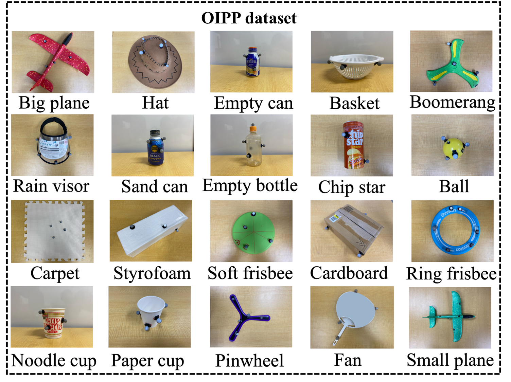

# 🚀 OIPP DATASET

This repository provides a trajectory dataset of 20 diverse objects with varying shapes and physical properties, each exhibiting different aerodynamic dynamics. The dataset has been specifically collected and designed to support research in **robotics, motion prediction, reinforcement learning, and dynamic modeling**. It serves as one of the main contributions of the project [OIPP: Object-Adaptive Impact Point Predictor for Catching Diverse In-Flight Objects](https://sites.google.com/view/robot-catching-2025/ホーム).

## 📂 Dataset Overview

The dataset includes:
- 20 distinct objects with varying shapes and physical properties, each exhibiting different aerodynamic behaviors.
- Recorded motion features:
    - including features: position, velocity, acceleration
    - sampling rate: 120hz
    - motion capture system: OptiTrack PrimeX13W

## 📥 Download & Usage

You can download the dataset by cloning this repository:

```bash
git clone https://github.com/Ngochuy2137/OIPP_dataset.git
```

## 📑 License and Citation

**Dataset License:** 
- Creative Commons Attribution 4.0 International (CC BY 4.0)
If you use this dataset, please cite the following paper: [OIPP: Object-Adaptive Impact Point Predictor for Catching Diverse In-Flight Objects](https://sites.google.com/view/robot-catching-2025)
- Full legal text available at: https://creativecommons.org/licenses/by/4.0/legalcode
<p align="center">
  
</p>
